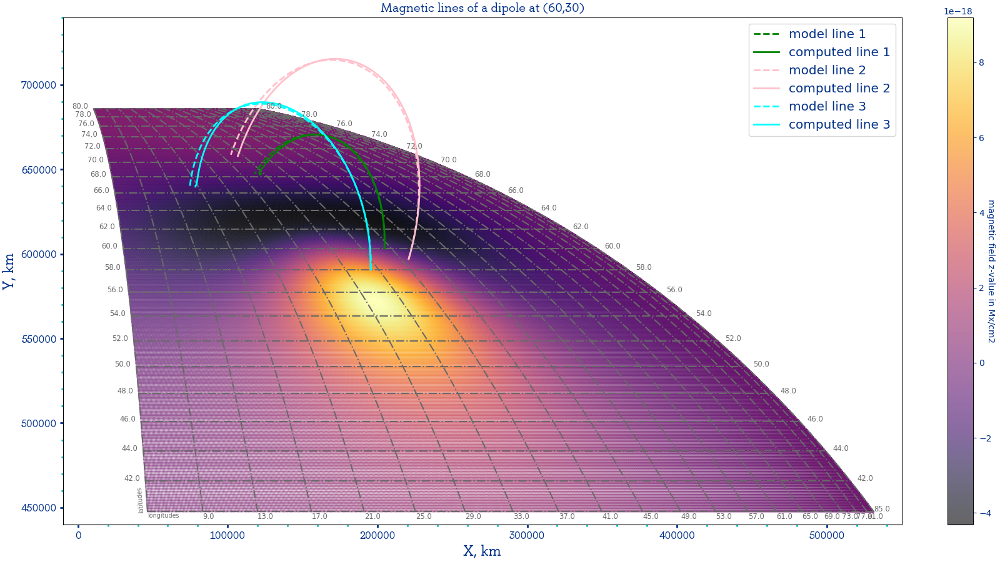

# sun
Всё что связано с моим дипломом.

## [computing.py](computing.py)
Крутой модуль с кучей функций для подсчёта сеток и магнитных линий. 

## [lib.py](lib.py)

Здесь сидит большой класс Grid, в котором отображается сетка, в которой можно задавать значение поля, а также функции для вычисления магнитного поля функцией Грина. Все вычисления магнитного поля используют класс Grid. Также есть класс Magneticline для хранения магнитных линий.

## [pipeline.py](pipeline.py)
Модуль для подготовки данных с HMI. Этот модуль ещё активно разрабатывается.......

## [time_testing.py](time_testing.py)

Модуль для проверки точности подсчёта от параметров сетки и расположения точки.

## [alertbot.py](alertbot.py)

Небольшой модуль для управления [телеграм-ботом](https://t.me/rafa_alert_bot), который присылает мне отчёты по вычислениям.

## [coordinates.py](coordinates.py)
Здесь сидит класс Coordinates - который переводит сразу во все системы координат заданную точку. Точку можно задавать тремя способами - Coordinates(x,y,z), Coordinates(r, phi, theta, spherical=True), Coordinates(r, lat, lon, latlon=True).
В будущем будет совместимость с [astropy.coordinates.SkyCoord](https://docs.astropy.org/en/stable/api/astropy.coordinates.SkyCoord.html), но для внутренних вычислений более простой класс работает быстрее.

## [field.py](field.py)
Здесь сидят функции для модельных полей.

## [plots.py](plots.py)
Здесь большой файл для оформления графиков, пока оттуда нужна лишь функция sphere для построения сетки проекции сферы.

## Файлы для тестирования

Разные файлы с testing и test в названии - для моих тестов. Возможно потом я всё почищу
